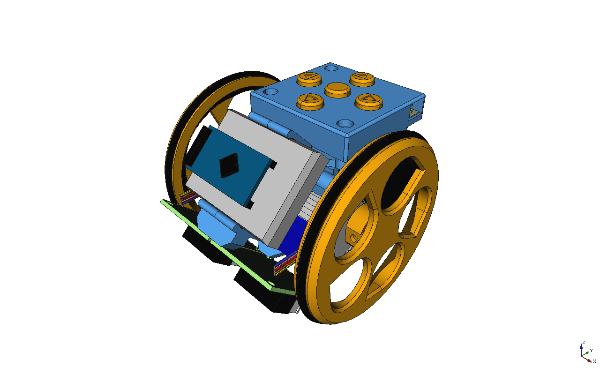

# Control de Versiones
- 0.3 (5//11/2017): se añade la posibilidad de pasar parámetros al objeto Escornabot, si se le pasa 1, se excita una bobina en cada paso, si se le pasa dos, se excitan dos bobinas en cada paso. Si no se le pasan parámetros se excita una bobina en cada paso por defecto.
- 0.2 (5/11/2017): Se corrige y depura código (se mejora declaración de variables evitando duplicidades), se mejora el comentado y sangrado del código.
- 0.1 (4/11/2017): Primera versión de librería.
# Librería para arduino Escornabot
Repositorio para albergar librería para manejar de forma amigable los motores paso a paso de Escornabot.

## Antecedentes
Unos de los problemas de escornabot es la ausencia de instrucciones amigables en arduino para controlar sus servomotores, todo ello pensando en el acercamiento del uso de dicho robot para estudiantes de secundaria. Para Todo ello desde el club de Tecnología, programación y robótica de Granada nos planteamos desarrollar una librería para dicho fin.
## Librería
La librería debemos cargar en arduino por los métodos tradicionales, incluyendo el zip o copiandola descomprimida en la carpeta "libraries" de arduino.
### procedimientos
- **mueve (vueltas, velocidad)**: Sirve para avanzar o retroceder. Se mueve el número de vueltas indicado, si son negativas va en el sentido contrario. La velocidad se da rpm
- **gira (vueltas, velocidad)**: Sirve para girar. Se indica como antes el número de vueltas o fracción a girar, si son positivas gira en un sentido y negativas en el contrario. La velocidad se da en rpm.
- **para ()**: detiene los dos motores.
### Ejemplo de código
~~~
#include <Escornabot.h>

Escornabot mirobot;//declaramos el objeto mirobot del tipo Escornabot

void setup() {
  // put your setup code here, to run once:
  Serial.begin (9600);

}

void loop() {
  // put your main code here, to run repeatedly:

  if (analogRead(7) == 769) { //si el botón adelante de escornabot está pulsado

    mirobot.mueve (1, 14); //mueve al objeto escornabot 1 vuelta hacia delante con velocidad 14 rpm
  }

  if (analogRead(7) == 516) { //si el botón atrás de escornabot está pulsado
    mirobot.mueve (-1, 14); //mueve al objeto escornabot 1 vuelta hacia atrás con velocidad 14 rpm

  }

  if (analogRead(7) == 685) { //si el botón derecha de escornabot está pulsado
    mirobot.gira (0.25, 14); //mueve al objeto 1/4 de vuelta hacia la derecha con velocidad 14 rpm

  }

  if (analogRead(7) == 882) { //si el botón izquierdo de escornabot está pulsado
    mirobot.gira (-0.25, 14); //mueve al objeto 1/4 de vuelta hacia la izquierda con velocidad 14 rpm

  }

  Serial.println (analogRead (7));

}
~~~
